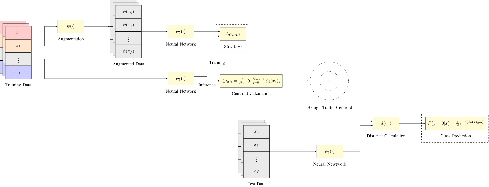
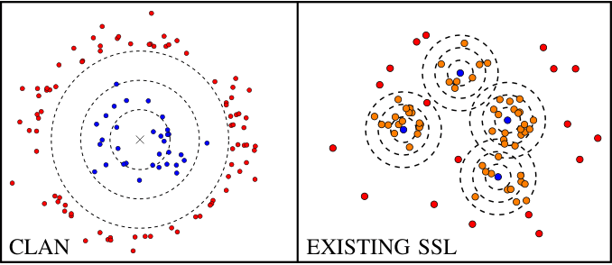

# Contrastive Self-Supervised Network Intrusion Detection Using Augmented Negative Pairs
<p align="center">
  
</p>

Official Github repo for the paper "Contrastive Self-Supervised Network Intrusion Detection Using Augmented Negative Pairs" available [here (published)](https://ieeexplore.ieee.org/document/11129979) and [here (accepted)](https://jackwilkie.github.io/papers/clan_main.pdf). This repository covers a reference implementation for the Contrastive Learning using Augmented Negatives (CLAN) method.

## CLAN

Unlike existing self-supevised learning algorithms which map augmentations to Gaussian noise; CLAN models benign network traffic as a coherent distribution in embedded space for improved perofrmance and faster inference:

<p align="center">
  
</p>

The loss function [`CLANLoss`](https://github.com/jackwilkie/CLAN/blob/main/loss/clan_loss.py#L75) in `loss/clan_loss.py` takes `x` (L2 normalised features from original samples) and `x_aug` (L2 normalised features from augmented samples) as inputs, and returns the loss.

Usage:

```python
from losses.clan_loss import CLAN

# define CLAN loss with a margin `m`
criterion = CLANLoss(m = m)

# features: [bsz, f_dim]
# features should L2 normalized in f_dim dimension
features = ...
# aug_features: [bsz, f_dim]
# aug_features should L2 normalized in f_dim dimension
aug_features = ...

# calculate loss
loss = criterion(x = features, x_aug = aug_features)
...
```

## Comparison
CLAN significantly outperforms previous self-supervised learning algortihms on network intrusion detection AUROC:

| Class                     | CLAN         | CLDNN       | SSCL-IDS    | ConFlow     | Barlow Twins | SimSiam     | BYOL        | VICReg      |
|----------------------------|--------------|-------------|-------------|-------------|--------------|-------------|-------------|-------------|
| Botnet                     | 0.915536     | 0.951724    | 0.953530    | 0.927866    | 0.977046     | 0.996176    | 0.985893    | 0.946107    |
| DDoS                       | 0.996584     | 0.989344    | 0.972851    | 0.925385    | 0.999179     | 0.999191    | 0.999782    | 0.999400    |
| DoS (Golden Eye)           | 0.931653     | 0.979910    | 0.841126    | 0.732904    | 0.896085     | 0.899778    | 0.905229    | 0.924664    |
| DoS (Hulk)                 | 0.977893     | 0.979486    | 0.982326    | 0.910926    | 0.994941     | 0.997693    | 0.990773    | 0.997170    |
| DoS (Slow HTTP Test)       | 0.991794     | 0.613476    | 0.523339    | 0.522115    | 0.633869     | 0.542329    | 0.508903    | 0.522023    |
| DoS (Slow Loris)           | 0.992513     | 0.873563    | 0.966009    | 0.953790    | 0.990351     | 0.982546    | 0.995689    | 0.984311    |
| FTP Patator                | 0.944212     | 0.996560    | 0.996554    | 0.997778    | 0.993760     | 0.999653    | 0.998454    | 0.996132    |
| Portscan                   | 0.989271     | 0.849846    | 0.994321    | 0.993277    | 0.979313     | 0.990024    | 0.997439    | 0.985080    |
| SSH Patator (Brute Force)  | 0.956259     | 0.958037    | 0.784271    | 0.903715    | 0.914556     | 0.864209    | 0.905103    | 0.840080    |
| Web Attack (Brute Force)   | 0.907790     | 0.784891    | 0.721126    | 0.817545    | 0.678314     | 0.786032    | 0.755342    | 0.654605    |
| Web Attack (XSS)           | 0.963409     | 0.849181    | 0.800105    | 0.880714    | 0.753717     | 0.765806    | 0.728249    | 0.690359    |
| Heartbleed                 | 0.997604     | 0.942537    | 0.993278    | 0.988757    | 0.999930     | 0.999278    | 0.999655    | 0.999871    |
| Web Attack (SQL Injection) | 0.897170     | 0.948995    | 0.966933    | 0.910350    | 0.916327     | 0.963398    | 0.954639    | 0.951767    |
| **Mean**                   | **0.958591** | 0.901350    | 0.884290    | 0.881933    | 0.902107     | 0.906624    | 0.901935    | 0.883967    |


CLAN also outperforms previous self-supervised models on F1-score when fine-tuned on a limited training set for multiclass classification:

| Samples | CLAN         | CLDNN        | SSCL-IDS     | Conflow      | Barlow Twins | SimSiam      | BYOL         | VICReg       |
|---------|--------------|--------------|--------------|--------------|--------------|--------------|--------------|--------------|
| 8       | **0.496316** | 0.379488     | 0.469348     | 0.480401     | 0.361244     | 0.482876     | 0.460014     | 0.389542     |
| 16      | **0.538254** | 0.438815     | 0.509693     | 0.501118     | 0.455801     | 0.470977     | 0.521448     | 0.440088     |
| 32      | **0.544964** | 0.483641     | 0.532057     | 0.532863     | 0.490422     | 0.512560     | 0.540308     | 0.513705     |
| 64      | **0.589188** | 0.535440     | 0.574097     | 0.571705     | 0.534474     | 0.555894     | 0.582854     | 0.528189     |
| 128     | **0.628799** | 0.589808     | 0.612588     | 0.617402     | 0.581268     | 0.603954     | 0.626497     | 0.593119     |
| 256     | 0.655416     | 0.644582     | 0.650703     | 0.651041     | 0.634673     | 0.645438     | **0.657744** | 0.631990     |
| 512     | **0.710183** | 0.683213     | 0.693791     | 0.705925     | 0.669987     | 0.684013     | 0.703609     | 0.665208     |
| 1024    | **0.738838** | 0.729141     | 0.731739     | 0.735170     | 0.719939     | 0.726593     | 0.735062     | 0.728573     |

Finally, CLAN outperforms existing anomlay detection algorithms on AUROC:

| Class                     | CLAN         | DUAD        | DAE-LR      | Deep SVDD    | AE          | IF          | AutoSVM     | SVM         | DAGMM       |
|----------------------------|--------------|-------------|-------------|--------------|-------------|-------------|-------------|-------------|-------------|
| Botnet                     | 0.915536     | 0.819026    | 0.759901    | 0.751007     | 0.671062    | 0.629887    | 0.641687    | 0.637679    | 0.605228    |
| DDoS                       | 0.996584     | 0.979402    | 0.997996    | 0.996513     | 0.908072    | 0.945021    | 0.933722    | 0.889780    | 0.876049    |
| DoS (Golden Eye)           | 0.931653     | 0.951141    | 0.952424    | 0.892923     | 0.855621    | 0.923275    | 0.887754    | 0.846840    | 0.736878    |
| DoS (Hulk)                 | 0.977893     | 0.967905    | 0.994860    | 0.993388     | 0.906273    | 0.955478    | 0.926223    | 0.894898    | 0.589771    |
| DoS (Slow HTTP Test)       | 0.991794     | 0.954526    | 0.981080    | 0.975533     | 0.962552    | 0.966122    | 0.968576    | 0.963021    | 0.899879    |
| DoS (Slow Loris)           | 0.992513     | 0.929777    | 0.986823    | 0.970622     | 0.897970    | 0.904747    | 0.880789    | 0.896824    | 0.955010    |
| FTP Patator                | 0.944212     | 0.962427    | 0.959192    | 0.968324     | 0.765372    | 0.762553    | 0.753264    | 0.736828    | 0.748862    |
| Portscan                   | 0.989271     | 0.982759    | 0.983505    | 0.948716     | 0.720184    | 0.803987    | 0.668389    | 0.741269    | 0.517609    |
| SSH Patator (Brute Force)  | 0.956259     | 0.889312    | 0.964803    | 0.962553     | 0.857118    | 0.845189    | 0.874968    | 0.799072    | 0.887558    |
| Web Attack (Brute Force)   | 0.907790     | 0.864899    | 0.594903    | 0.673249     | 0.784379    | 0.713374    | 0.736061    | 0.767771    | 0.825337    |
| Web Attack (XSS)           | 0.963409     | 0.942706    | 0.564499    | 0.658500     | 0.780935    | 0.702785    | 0.730008    | 0.761677    | 0.810560    |
| Heartbleed                 | 0.997604     | 0.979357    | 0.999801    | 0.998676     | 0.989079    | 0.999801    | 0.994511    | 0.993468    | 0.978630    |
| Web Attack (SQL Injection) | 0.897170     | 0.830627    | 0.848514    | 0.744588     | 0.731559    | 0.752289    | 0.745230    | 0.745087    | 0.653157    |
| **Mean**                   | **0.958591** | 0.927221    | 0.891408    | 0.887276     | 0.833090    | 0.838808    | 0.826245    | 0.821093    | 0.775733    |

## Running 

### (1) Install Requirements

This repository requires python3 and Pytorch. To install the required dependencies run:

```
pip install -r requirements.txt
```

### (2) Download Dataset

Models and baselines are trained and evaluated on the **Lycos2017** dataset.

You can either:
- Download the original CSV files from [here](https://lycos-ids.univ-lemans.fr), combine them into a single file, and name it `lycos.csv`,  
**or**
- Download a preprocessed version directly from [here](https://drive.google.com/file/d/1PUMAbjz5L0MKiL3P-bEFTYYOcB6zPYB2/view?usp=share_link).

Once downloaded, move the file to: `./data/lycos.csv`.

### (3) Train Model

CLAN can be trained using the [train_clan.py](./train_clan.py) script:

```
python3 train_clan.py
```

This will train the model and save the weights to `./weights/clan.pt.tar`.

### (4) Evaluate Model

CLAD can be evaluated by running [eval_clan.py](./eval_clan.py):

```
python3 eval_clan.py
```

The performance metrics of the model will be printed to the terminal after evaluation.

### (4) Evaluate Models

CLAD can be finetuned by running [finetune_clan.py](./finetune_clan.py):

```
python3 finetune_clan.py
```

This will finetune the model and save the weights to `./weights/clan_finetuned.pt.tar`.

The performance metrics of the model will also be printed to the terminal.

## Citation
```
@INPROCEEDINGS{11129979,
  author={Wilkie, Jack and Hindy, Hanan and Tachtatzis, Christos and Atkinson, Robert},
  booktitle={2025 IEEE International Conference on Cyber Security and Resilience (CSR)}, 
  title={Contrastive Self-Supervised Network Intrusion Detection Using Augmented Negative Pairs}, 
  year={2025},
  volume={},
  number={},
  pages={206-213},
  keywords={Limiting;Accuracy;Network intrusion detection;Machine learning;Contrastive learning;
  Data augmentation;Usability;Computer crime;Anomaly detection;Resilience;
  Network Intrusion Detection Systems;Anomaly Detection;Self-Supervised Learning;Contrastive Learning;
  Machine Learning},
  doi={10.1109/CSR64739.2025.11129979}
}
```
